# Perforce Server for Synology NAS (Docker)

A simplified, Perforce (Helix Core) server deployment for Synology NAS using Docker. Optimized for Unreal Engine projects with case-insensitive mode enabled.

**Based on the work of:**
- [Froyok/froyok-perforce](https://github.com/Froyok/froyok-perforce)
- [HaberkornJonas/Perforce-Server-On-Docker-For-Unreal](https://github.com/HaberkornJonas/Perforce-Server-On-Docker-For-Unreal)
- [Snipe3000/Perforce-Server-On-Docker-For-Unreal](https://github.com/Snipe3000/Perforce-Server-On-Docker-For-Unreal)

## 📋 Table of Contents

- [Prerequisites](#prerequisites)
- [Quick Start](#quick-start)
- [Installation](#installation)
- [Connecting with P4V](#connecting-with-p4v)
- [Power Outage & Data Safety](#power-outage--data-safety)
- [Folder Structure](#folder-structure)
- [Troubleshooting](#troubleshooting)

## 🔧 Prerequisites

### Hardware Requirements
- **Synology NAS** running DSM 7.0 or higher
    - In case you wanted to know : I am using `DS923+` for my setup
- **Minimum 2GB RAM** (4GB+ recommended for large projects)
- **Sufficient Storage** for your project files

### Software Requirements
- **Container Manager** (installed from Synology Package Center)
- **SSH Access** (optional, for advanced configuration)
- **Perforce P4V Client** (download from [Perforce website](https://www.perforce.com/downloads/helix-visual-client-p4v))

### Network Requirements
- Static IP address for your NAS (recommended)
- Port **1666** available (default Perforce port)
- Port **8080** available (optional, for web interface)

## 🚀 Quick Start

```bash
# 1. Clone this repository
git clone https://github.com/ProblemBears/Perforce-Server-On-Docker-For-Unreal.git

# 2. Edit docker-compose.yml - change the password!
# Look for: P4PASSWD=CHANGE_ME_YOUR_PASSWORD_HERE

# 3. Edit p4-users.txt - add your email
# Look for: Email: admin@yourcompany.com

# 4. Upload all files to your NAS at: /volume1/docker/perforce/

# 5. Create required folders on NAS:
#    - /volume1/docker/perforce/data/
#    - /volume1/docker/perforce/logs/

# 6. Deploy via Container Manager (see Installation section)
```

## 📦 Installation

### Step 1: Prepare Your NAS

1. **Open File Station** on your Synology NAS
2. Navigate to `volume1` (or your main volume)
3. Create the folder structure:
   ```
   /volume1/docker/perforce/
   ├── data/       (empty folder)
   └── logs/       (empty folder)
   ```
   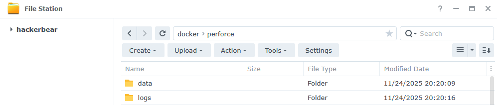</img>

### Step 2: Configure (IMPORTANT!)

**Before deploying, you MUST change these:**

#### **A. Edit `docker-compose.yml`**

Find this line:
```yaml
- P4PASSWD=CHANGE_ME_YOUR_PASSWORD_HERE   # ⚠️ CHANGE THIS PASSWORD!
```

Replace `CHANGE_ME_YOUR_PASSWORD_HERE` with your desired password.

**Optional Changes:**
- Change `P4USER=p4admin` if you want a different admin username
- Update volume paths if your NAS doesn't use `/volume1/`

#### **B. Edit `p4-users.txt`**

Find these lines:
```
Email:	admin@yourcompany.com
# ⬆️ CHANGE THIS to your real email address

FullName:	Perforce Administrator
# ⬆️ CHANGE THIS to your name (optional)
```

Replace with your actual email address (for notifications).

### Step 3: Upload Files

1. Download or clone this repository to your computer
2. Upload ALL files to `/volume1/docker/perforce/` on your NAS:
   - `docker-compose.yml`
   - `Dockerfile`
   - `run.sh`
   - `setup-perforce.sh`
   - `p4-users.txt`
   - `p4-groups.txt`
   - `p4-protect.txt`
   - `p4d.template`
   - `p4dctl.conf`
   - `typemap.txt`

<div align="center">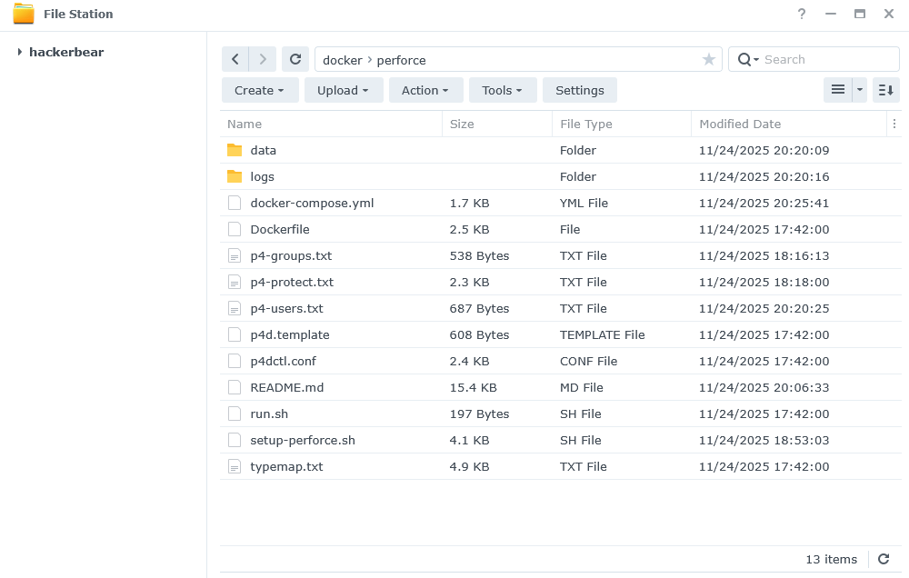</img></div>

### Step 4: Deploy via Container Manager

1. Open **Container Manager** in DSM
2. Click **Project** tab (left sidebar)
3. Click **Create** button
4. Configure the project:
   - **Project Name:** `perforce-server` (or your choice)
   - **Path:** Navigate to `/volume1/docker/perforce/`
   - **Source:** Should auto-detect `docker-compose.yml`
5. Click **Next**
6. **Uncheck** "Set up web portal via Web Station" (not needed)
7. Click **Done**
    - It should start building the project. Move on to the next step.

<div align="center">
    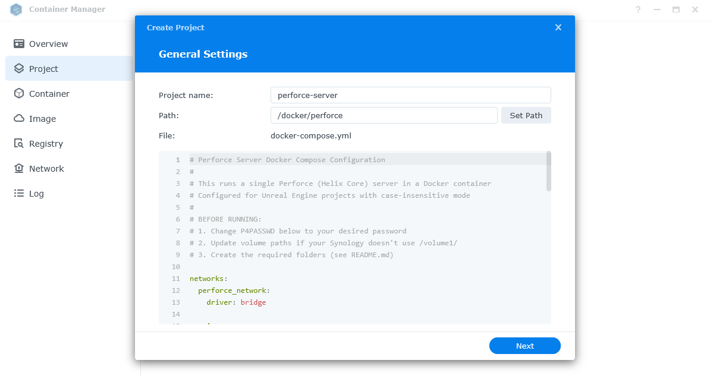</img>
    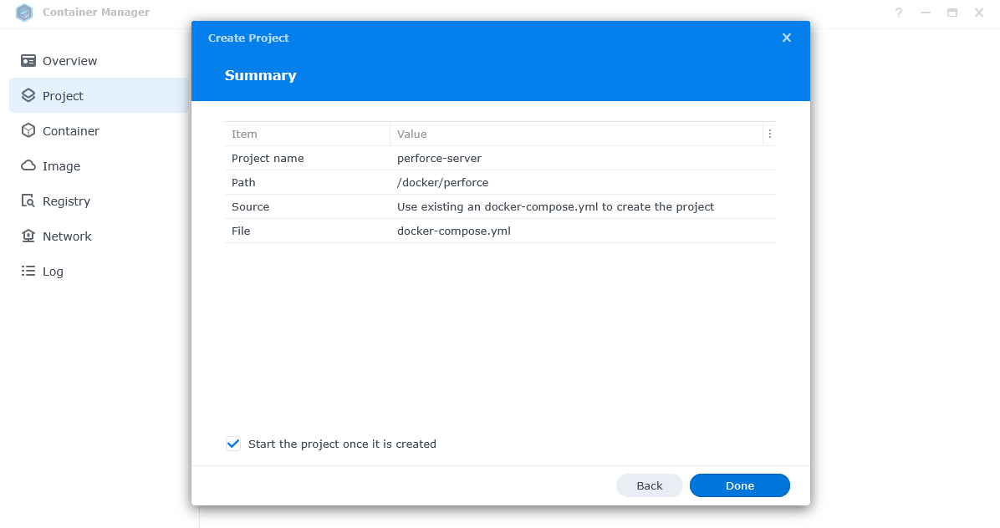</img>
</div>

### Step 5: Wait for Build

Container Manager will:
- Build the Perforce Docker image (~5-10 minutes first time)
- Create and start the container
- Initialize the Perforce depot

**Watch the logs for success messages!**
<div align="center">
    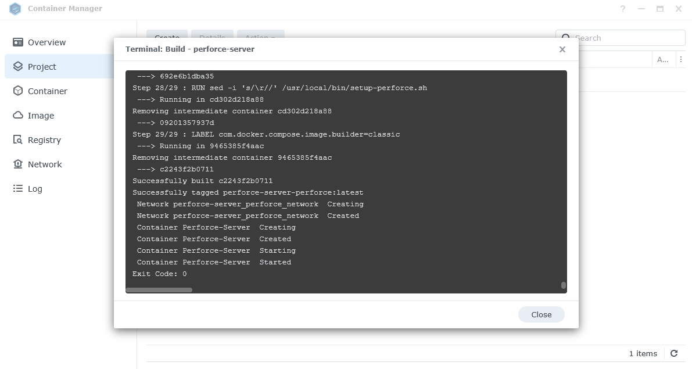</img>
</div>

### Step 6: Verify Deployment

1. Go to **Container** tab in Container Manager
2. Verify **Perforce-Server** is **Running** (green status)
3. Click on the container → **Logs** tab
4. Look for these success messages:
   ```
   SSL certificate generated
   Perforce server is up and running on port 1666
   First time installation, setting up defaults...
   P4USER=p4admin (the admin user)
   ```
5. **IMPORTANT:** Find and copy the SSL fingerprint:
   ```
   The SSL fingerprint is: XX:XX:XX:XX:XX:XX:...
   ```
   You'll need this to connect with P4V!

<div align="center">
    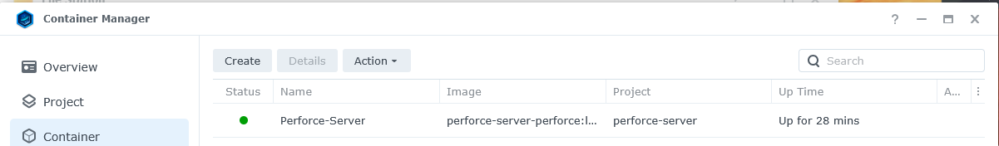</img>
</div>

## 🔗 Connecting with P4V

### Step 1: Download P4V

Download Perforce Visual Client (P4V) for your platform from :  
https://www.perforce.com/downloads/helix-visual-client-p4v

<div align="center">
    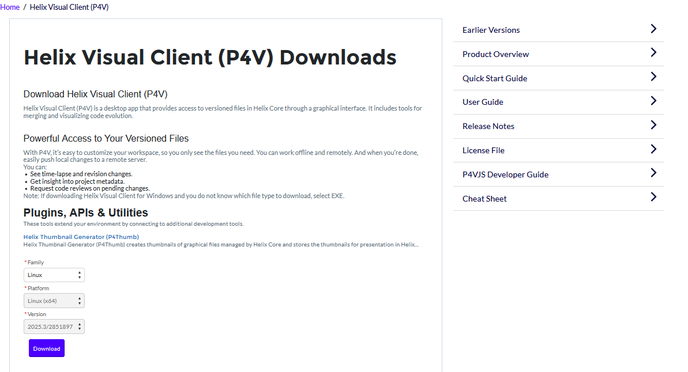</img>
    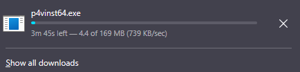</img>
</div>


### Step 2 : Step through the Setup Wizard 

<div align="center">
    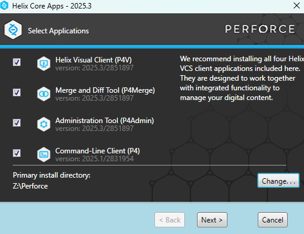</img>
    <br />
    <br />
    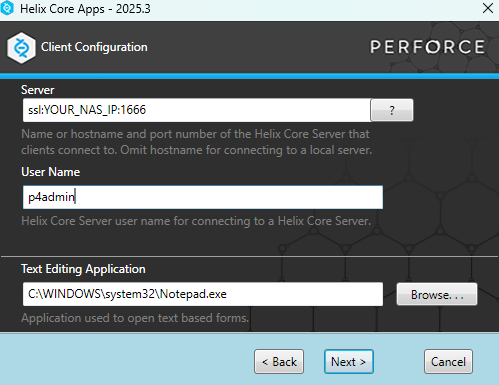</img>
    <br />
    <br />
    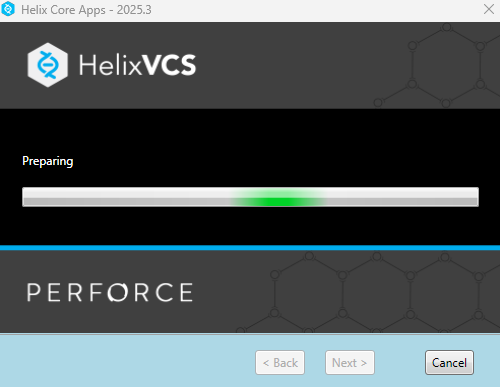</img>
    <br />
    <br />
    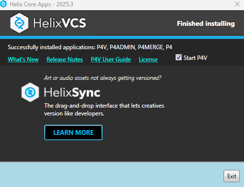</img>
    <br />
    <br />
    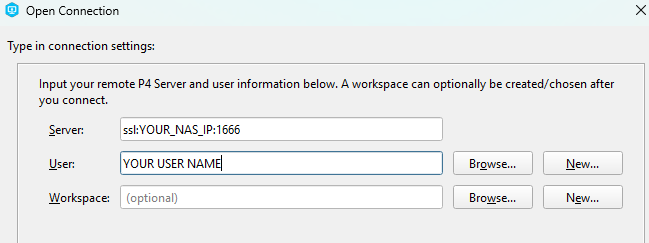</img>
</div>

### Step 2: First Connection

1. Launch **P4V**
2. The "Open Connection" dialog appears
3. Fill in:
   - **Server:** `ssl:YOUR_NAS_IP:1666`  
     - Example: `ssl:192.168.1.100:1666`
   - **User:** `p4admin` (or whatever you changed it to)
   - **Workspace:** Leave blank for now
4. Click **OK**

### Step 3: Trust SSL Certificate

You'll see a security warning with the SSL fingerprint.

✅ **Compare this to the fingerprint from the container logs**  
✅ **If they match** → Click **Trust Always**  
❌ **If they don't match** → STOP and investigate

### Step 4: Enter Password

Enter the password you set in `docker-compose.yml`

🎉 **You're connected!**

## 🔋 Power Outage & Data Safety

### Is My Data Safe?

**YES!** This setup is power-outage safe.

### What Happens During Power Loss?

1. **NAS Shuts Down** → Container stops
2. **NAS Restarts** → DSM boots
3. **Container Manager Starts** → Auto-starts enabled containers
4. **Perforce Restarts** → `restart: unless-stopped` policy
5. **Data Loads** → Depot data loads from `/volume1/docker/perforce/data/`
6. **Server Ready** → Perforce is back online

### What Data is Protected?

✅ **All submitted files** - Safely stored in the depot  
✅ **All changelists** - Persisted to disk  
✅ **User accounts** - Configuration is saved  
✅ **Permissions** - Protection tables are preserved  
✅ **Server settings** - All configuration persists  

## 📁 Folder Structure

### On Your NAS:
```
/volume1/docker/perforce/
├── data/                       # Perforce depot data (BACKUP THIS!)
│   ├── p4depot/
│   │   ├── depot/             # Your versioned files
│   │   ├── ssl/               # SSL certificates
│   │   └── db.*               # Database files
│   └── etc/                   # Perforce config
├── logs/                       # Server logs
├── docker-compose.yml          # Container orchestration
├── Dockerfile                  # Image build instructions
├── run.sh                      # Container entry point
├── setup-perforce.sh           # First-run setup script
├── p4-users.txt               # User definitions
├── p4-groups.txt              # Group definitions
├── p4-protect.txt             # Permission table
├── p4d.template               # Daemon template
├── p4dctl.conf                # Daemon config
└── typemap.txt                # File type mappings (UE-optimized)
```

### What Gets Created Automatically:
```
/volume1/docker/perforce/data/
├── p4depot/                   # Created on first run
│   ├── depot/                # Your files go here
│   ├── ssl/                  # SSL certs generated here
│   ├── db.* files            # Database tables
│   └── logs/                 # Server logs
└── etc/                      # Config files
```

## 🐛 Troubleshooting

### Container Won't Start

**Check logs in Container Manager:**
1. Container tab → Click **Perforce-Server**
2. **Logs** tab → Look for error messages

**Common Issues:**
- **Port 1666 in use** → Another service is using this port
  ```bash
  # Check what's using the port (via SSH):
  sudo netstat -tulpn | grep 1666
  ```
- **Permission errors** → Check folder permissions in File Station
- **Build failed** → Check Docker logs for missing dependencies

### Can't Connect from P4V

**Test connectivity first:**

On Windows (PowerShell):
```powershell
Test-NetConnection -ComputerName YOUR_NAS_IP -Port 1666
```

On Mac/Linux:
```bash
telnet YOUR_NAS_IP 1666
```

**If connection fails:**
1. Check container is Running in Container Manager
2. Check NAS firewall: Control Panel → Security → Firewall
3. Try without `ssl:` prefix: `YOUR_NAS_IP:1666`
4. Check router port forwarding (if accessing from outside network)

### SSL Certificate Errors

**Symptoms:** "SSL handshake failed" or certificate warnings

**Solutions:**
1. Check container logs for SSL certificate generation
2. Verify fingerprint matches between logs and P4V
3. Try regenerating certificates:
   ```bash
   # SSH into NAS, then:
   docker exec -it Perforce-Server bash
   rm -rf /data/p4depot/ssl/*
   exit
   # Restart container in Container Manager
   ```

### Case Handling is "sensitive" Instead of "insensitive"

**Symptoms:** `p4 info` shows `Case Handling: sensitive`

**Cause:** Database was already created with wrong settings

**Fix:**
1. Stop the project in Container Manager
2. **BACKUP** `/volume1/docker/perforce/data/` (if you have important data!)
3. Delete contents of `/volume1/docker/perforce/data/`
4. Start the project again
5. Server will recreate with correct case-insensitive mode

### Performance Issues

**Symptoms:** Slow submits, timeouts, high CPU usage

**Solutions:**
1. **Increase NAS RAM** - Perforce is memory-intensive
2. **Use SSD storage** - Put `/data/` folder on SSD if available
3. **Limit workspace size** - Don't sync entire depot if not needed
4. **Check network speed** - Gigabit Ethernet recommended
5. **Monitor NAS resources** - Resource Monitor in DSM

### "Perforce Server Failed to Start"

**Check logs for:**
```
Perforce server failed to start after 10 attempts
```

**Solutions:**
1. Check if port 1666 is blocked
2. Verify volumes are mounted correctly
3. Check disk space on NAS
4. Review setup-perforce.sh logs for errors

## 📊 Common p4 Commands (Reference)

Access container terminal: Container Manager → Perforce-Server → Terminal → Create (bash)

```bash
# Server info (check case handling)
p4 info

# List all users
p4 users

# List all depots
p4 depots

# View protections table
p4 protect -o

# View typemap
p4 typemap -o

# Create checkpoint (backup)
p4 admin checkpoint

# Verify file integrity
p4 verify //...

# Show server configuration
p4 configure show
```

## 🔄 Updating Perforce Version

To update to a newer version of Perforce:

1. **Backup your data** first!
2. Edit `Dockerfile`, find this line:
   ```dockerfile
   ARG P4_VERSION=2025.1
   ```
3. Change version to desired version (check [Perforce downloads](https://www.perforce.com/downloads))
4. In Container Manager → Project tab → Select project
5. **Action** → **Build** (rebuilds image with new version)
6. **Action** → **Stop** then **Start**

## 📚 Additional Resources

- **Perforce Documentation:** https://www.perforce.com/manuals/p4sag/
- **Unreal Engine + Perforce:** https://docs.unrealengine.com/en-US/Engine/Basics/SourceControl/Perforce/
- **P4V User Guide:** https://www.perforce.com/manuals/p4v/
- **Synology Docker Guide:** https://kb.synology.com/en-global/DSM/help/ContainerManager/